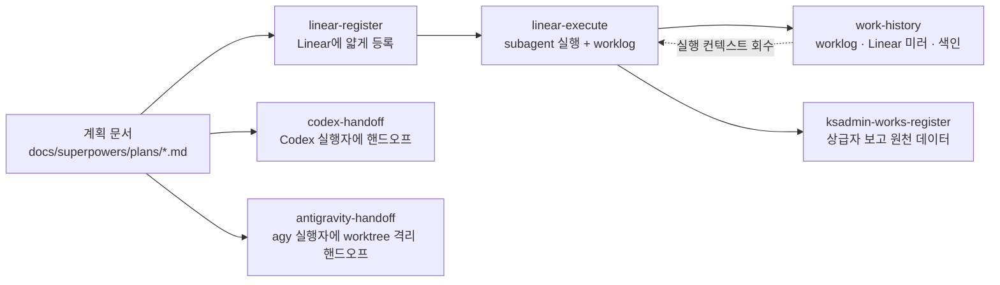

> **Custom Skill** 은 마켓플레이스에서 설치하는 플러그인이 아니라 **내가 직접 작성한 `SKILL.md` 지침 패키지**다. 작업 내용이 스킬 설명과 맞으면 Claude가 스스로 로드해 그 절차를 따른다. 이 글은 커스텀 스킬의 개념과 디렉토리 구조, 현재 보유한 스킬 6종(`codex-handoff` · `antigravity-handoff` · `linear-register` · `linear-execute` · `work-history` · `ksadmin-works-register`)과 스킬 간 연결 관계를 정리한다.

## Custom Skill 이란?

[Plugins 글](/claude-code/plugins/)에서 본 "스킬(Skills)"을 **직접 만들어 쓰는 것**이다. 반복되는 작업 절차(Linear 등록 규칙, 보고 시스템 입력 규칙, 실행자 핸드오프 루프 등)를 마크다운 한 벌로 고정해 두면, 매 세션 설명을 반복하지 않아도 Claude가 같은 규율로 움직인다.

- **위치**: 전역은 `~/.claude/skills/스킬명/SKILL.md`, 프로젝트 한정은 `프로젝트/.claude/skills/`. 스킬 저장소(`~/brainstorming/skills/`)를 정본으로 두고 전역 디렉토리에는 심볼릭 링크로 건다
- **트리거**: frontmatter의 `description`이 자동 호출 판단 기준이다. 사용자가 실제로 쓸 법한 문구("Linear에 등록", "codex로 실행해")를 description에 그대로 넣어야 정확히 발동한다. `/스킬명` 으로 직접 호출도 가능
- **컨텍스트 비용**: 세션 시작 시에는 `name` · `description` 만 로드되고 본문은 발동될 때만 읽힌다 — 스킬 수가 늘어도 본문 길이는 평소 토큰을 차지하지 않는다
- **플러그인과의 관계**: 플러그인은 배포 단위(커맨드 · 에이전트 · 스킬 · 훅 · MCP 묶음), 스킬은 그 안의 지침 단위. 커스텀 스킬은 배포 없이 로컬 디렉토리로만 관리한다

## 스킬 디렉토리 구조

| 구성 요소 | 역할 | 사용하는 스킬 |
|---|---|---|
| `SKILL.md` | **필수.** frontmatter(`name`, `description`) + 본문 지침. 발동 시 통째로 로드된다 | 6종 전부 |
| `references/` | 본문이 참조하는 보조 규약 문서 — 필요할 때만 읽어 컨텍스트를 아낀다 | codex-handoff · antigravity-handoff (plan-format, executor-protocol — 두 스킬에 동일 사본, 동기화 주석) |
| `adapters/` | 실행 대상별 변형 지침 | codex-handoff (codex) · antigravity-handoff (antigravity) |
| `tools/` | 스킬이 배포하는 스크립트 참조 구현 — 재구현하지 않고 복사해 쓴다 | work-history (`linear-export.py`, `gen-history-index.py`) |
| `스킬명-사용가이드.md` | 사람이 읽는 가이드 — 발동 문구, 왜 필요한가, 흐름 요약 (대부분 html 버전 동봉) | 6종 전부 |

**설치** — 저장소를 정본으로 두고 전역 스킬 디렉토리에 링크한다. 새 세션부터 자동 로드된다.

```bash
ln -sfn ~/brainstorming/skills/linear-register ~/.claude/skills/linear-register
```

## 보유 커스텀 스킬 6종

| 스킬 | 한 줄 역할 | 발동 문구 |
|---|---|---|
| `codex-handoff` | 계획은 Claude, 구현은 Codex — 태스크를 넘기고 검증만 하는 인라인 핸드오프 루프 | "codex로 실행해", "codex에게 넘겨", "핸드오프로 진행" |
| `antigravity-handoff` | `실행자: agy` 태스크(UI 완성도가 중요한 작업)를 저장소 밖 worktree 격리로 Antigravity에 넘기고 검증하는 핸드오프 루프 | "antigravity로 실행해", "agy에게 넘겨", "UI 태스크는 antigravity로" |
| `linear-register` | 계획 문서를 Linear에 프로젝트 · 마일스톤 · 이슈 · 하위 이슈로 얇게 등록 | "Linear에 등록", "이슈 만들어줘", "마일스톤 정리해줘" |
| `linear-execute` | Linear 이슈를 subagent에 위임해 실행하고 상태 전환 · worklog 기록까지 오케스트레이션 | "이슈 처리해줘", "프로젝트 실행", "PLA-123부터 해줘" |
| `work-history` | worklog · Linear 로컬 미러 · 도메인 색인으로 AI가 과거 작업을 grep 한 방에 회수하게 만드는 인프라 | "작업 이력 관리", "worklog 도입", "히스토리 검색이 안 됨" |
| `ksadmin-works-register` | Linear · 계획 파일 · 대화 내용을 ksadmin-works 보고 구조(업무/작업 영역/이슈/진행내역)로 등록 · 갱신 | "ksadmin에 등록", "업무 등록해줘", "진행내역 기록해줘" |

### codex-handoff — 계획은 Claude가, 구현은 Codex가 (비용 최적화 실행 루프)

- **무엇을 하나**: `docs/superpowers/plans/주제.md` 의 태스크를 하나씩 `codex exec` 로 넘기고, Claude는 diff 검토와 `검증:` 커맨드 실행만 담당한다. 코드 생성 토큰을 실행자(Codex) 쪽 요금제로 넘겨 Claude 사용량을 아낀다
- **전제**: 계획 파일이 `references/plan-format.md` 형식(태스크마다 `검증:` 줄)을 따라야 한다. 검증이 없는 태스크는 넘기지 않는다
- **실행자 규약은 프로젝트에 심지 않는다**: 대상 프로젝트의 `AGENTS.md` 를 오염시키지 않기 위해, 핸드오프 프롬프트에 `references/executor-protocol.md` 의 해당 모드 섹션 **전문을 내장**한다
- **루프**: 핸드오프 → 판정(`git diff` + `git status -uall` 로 범위 밖 수정 확인, 검증 커맨드 직접 실행) → 통과 시 체크박스 갱신 · 커밋 / 실패 시 `resume --last` 로 **1회만** 재시도 → 재실패 시 멈추고 사용자에게 보고
- **실측 함정**: 비대화형 환경에서 `codex exec` 는 stdin 을 닫지 않으면 "Reading additional input from stdin..." 에서 무한 블록된다(2026-08-04 실측, 25분+ 무진척). 반드시 `< /dev/null` 을 붙이고 `tee` 로 로그를 남겨 멈춤을 진단 가능하게 한다
- **대상 태스크**: `실행자:` 가 없거나 codex 인 태스크만 처리한다. `실행자: agy` 태스크는 건너뛰고 완료 보고에 "antigravity-handoff 로 실행할 태스크"로 나열한다 — 기본 실행자는 codex(범위 규율 우수), UI 완성도가 중요한 태스크만 agy
- **셸 인용**: 규약 본문에 백틱이 있어 프롬프트를 이중따옴표에 직접 넣으면 명령 치환으로 깨진다 — 인용 히어독으로 파일에 쓰고 `$(cat 파일)` 로 넘긴다. 로그 · 프롬프트 파일은 프로젝트 밖에 두고 종료 코드는 `PIPESTATUS` 로 본다
- **병렬 디스패치**: 파일이 겹치지 않는 태스크는 동시에 넘기되, 각 실행자에게는 자기 테스트 파일만 검증시키고 전체 테스트 · typecheck 는 배치 완료 후 오케스트레이터가 돌린다
- **하지 말 것**: Claude가 직접 구현 코드 작성, 태스크당 3회 이상 실행자 호출, 프로젝트 규칙 파일에 실행자 규약 심기
- **구성 파일**: `SKILL.md`, `references/plan-format.md`, `references/executor-protocol.md`, `adapters/codex.md`, 사용가이드

### antigravity-handoff — `실행자: agy` 태스크를 worktree 격리로 Antigravity에 넘기는 핸드오프 루프

- **무엇을 하나**: codex-handoff 와 계약(계획 형식 · 실행자 규약)은 같고 **격리 절차만 다르다**. 계획 파일에서 `실행자: agy` 로 지정된 태스크만 집어 저장소 밖 worktree 에서 `agy` 를 돌리고, Claude 는 판정 · 반입 · 검증만 한다. `실행자:` 가 없거나 codex 인 태스크는 건너뛰고 codex-handoff 로 넘긴다
- **왜 따로 있나 (2026-08-03 실측)**: agy 는 UI/UX 완성도 · 테스트 품질 상한이 높지만 범위 규율이 약하다 — 대상 외 디렉토리 삭제 1회, 저장소 내 worktree 격리 탈출 1회. 그래서 프롬프트 가드레일이 아니라 **구조(worktree)** 로 피해를 차단한다
- **격리 조건 둘 다 필수**: ① worktree 는 저장소 **밖** `~/ag-worktrees/프로젝트명/ag-tN` — 안에 두면 agy 가 상위로 올라가 본체를 잡는다 ② `--new-project` 로 기존 프로젝트 추론 차단. `/tmp` 는 쓰지 않는다 — snap strict 설치된 agy 에게는 호스트 `/tmp` 가 보이지 않는다(2026-09-11 실측, agy 1.2.0)
- **루프**: worktree 생성 → 프롬프트 파일 작성(규약 전문 + 범위 가드레일 문장, 생략 불가) → `agy --dangerously-skip-permissions --new-project -p "$(cat 파일)"` → worktree 안에서 판정(센티널 + `git status -uall` + 검증 커맨드 직접 실행) → 통과 시 `대상:` 파일**만** 본체로 복사 → 본체 검증 재실행 → 체크박스 · 커밋 → worktree remove + 브랜치 삭제
- **판정 게이트는 오케스트레이터의 자체 검증**: 센티널이 TASK_FAIL 이어도 자체 검증이 통과하면 통과(snap 안에서 호스트 도구를 못 찾는 경우). 실패 시 같은 worktree 에서 `-c` 로 **1회만** 재시도, 재실패 시 보고
- **하지 말 것**: 본체 디렉토리에서 agy 실행, 저장소 안에 worktree 생성, worktree 브랜치 통째로 merge, 태스크당 3회 이상 호출
- **구성 파일**: `SKILL.md`, `references/plan-format.md` · `references/executor-protocol.md`(codex-handoff 와 동일 사본), `adapters/antigravity.md`(agy 편입 · Linear MCP · 실측 기록), 사용가이드
- **짝 스킬**: `codex-handoff`(기본 실행자) · `linear-register`(대형 · 병렬 작업은 Linear 큐로)

### linear-register — 계획을 Linear에 얇게 등록 (이슈는 "왜 + 결과"만)

- **무엇을 하나**: 구조화된 마크다운 계획(Feature / Task / Step)을 파싱해 **프로젝트 → 마일스톤 → 이슈 → 하위 이슈** 4단으로 등록한다. 등록 후 종료하며, 실행 여부는 사용자가 결정한다
- **핵심 철학**: 이슈는 얇게, 과정은 파일로. 이슈 본문은 **배경 / 범위 / 완료 기준** 3섹션뿐이고, 작업 과정 · 실측 · AI 문답은 worklog 파일(`work-history`)로 보낸다. "코멘트를 새로 달고 싶어지면 그건 진행기록이다 → worklog로"
- **마일스톤 = 관심사/영역, 순서 아님**: "네트워크", "셀프서비스 포탈"처럼 영역으로 나눈다. Phase 1/2/3 같은 진행 순서로 나누지 않고, 순서는 이슈 `blockedBy` 로만 표현한다. 같은 이슈를 다른 관점으로 묶는 렌즈 마일스톤은 선택적
- **이름 규칙**: 순서 넘버링(Phase 2, P1, Step 3) 금지. 대신 [영역] 태그 · `PLA-NNN` 참조 같은 grep 앵커는 제목에 넣는다
- **코멘트는 2종만**: 이슈 해결에 꼭 필요한 참고사항 + **완료 코멘트**(목표 / 계획 vs 실제 / 측정 / 함정 요약). 중간 진행 · 변경 이력 코멘트는 금지
- **재등록 = 갱신**: 새로 만들기 전에 프로젝트 안에서 대응 객체를 의미 매칭으로 찾고, 있으면 본문을 갱신한다. 중복 생성 금지
- **정본은 파일, Linear는 포인터**: 스펙 · 계획 · 데이터 딕셔너리는 `docs/` 에 두고 이슈는 그 경로를 가리키기만 한다
- **팀 · 상태 · 담당 고정값 없음**: 등록 시점에 사용자 확인 또는 대상 프로젝트 관례를 따른다
- **짝 스킬**: `linear-execute`(실행) · `work-history`(과정 · 이력)

### linear-execute — Linear 이슈를 subagent에 위임해 실행하는 오케스트레이터

- **무엇을 하나**: 프로젝트의 이슈를 가져와 `blockedBy` 가 풀린 것부터 subagent 에 디스패치하고, 상태 전환(시작 상태 → In Progress → Done)과 worklog 기록을 맡는다. 별도 로컬 작업 파일 없이 **이슈 description 의 `## 범위` / `## 완료 기준` 이 작업 소스**이며, 완료 기준이 통과 게이트다
- **착수 = worklog 파일 생성, 예외 없음**: 디스패치 전에 `docs/worklog/IDENT-슬러그.md` 를 만든다. 진행 · 실패 · 재시도 · 스킵은 전부 worklog 엔트리(착수 / 결과 / 실패 / 스킵 4형식)로 가고, **Linear 코멘트는 완료 시 1개뿐**
- **실행 컨텍스트는 worklog에서 읽는다**: 디스패치 전에 같은 영역의 기존 worklog 를 `rg` 로 찾아 선행 작업의 우회 · 핀 · 예외, 직전 실패의 진단, cross-task 시그니처를 프롬프트에 인라인한다. 오케스트레이터 머릿속에 두면 다음 세션의 AI가 같은 함정을 다시 밟는다
- **순차 / 병렬 판단**: 수정 파일이 겹치지 않으면 병렬, 같은 파일 소규모 변경은 순차, 같은 파일 대규모 변경은 worktree 격리 후 병렬. 3개 이상 대량 병렬이면 커밋을 오케스트레이터가 일괄 처리(git lock 충돌 방지)
- **Done 조건은 관측 가능하게**: 배포 파이프라인이 있으면 스테이징 배포 + e2e 통과 시점, 없으면 완료 기준 전 항목 충족 + 테스트 통과. DB 마이그레이션 동반이면 실 배포까지. **커밋했다는 것만으로 Done을 찍지 않는다**
- **완료는 한 묶음**: Done 전환 + 완료 코멘트 1개 + worklog `done/` 이관 + 같은 커밋에 `linear-export.py` · `gen-history-index.py` 실행 결과 포함
- **실패 시**: In Progress 유지, worklog 에 실패 엔트리(진행 / 실패 지점 / 원인 / 처방) 기록 후 사용자에게 재시도 · 스킵 · 중단 판단을 받는다. 재시도 프롬프트에는 직전 실패의 원인과 처방을 인라인한다
- **짝 스킬**: `linear-register`(등록) · `work-history`(기록 규율) · `ksadmin-works-register`(보고 반영)

### work-history — AI가 과거 작업을 grep으로 스스로 회수하게 만드는 인프라

- **왜 필요한가**: Linear 는 이슈가 수백 건 쌓이면 본문 · 코멘트 내용 검색이 안 되어 AI가 과거 결정을 회수하지 못한다. 치명 사례 — 업스트림 코어를 직접 패치해 뒀는데 AI가 그걸 모르고 원본(vanilla) 기준으로 작업을 시작함
- **해법 한 문장**: **과정은 파일에 · Linear는 로컬로 미러 · 검색은 grep으로.** 프로젝트 전체 이슈를 합쳐도 텍스트 10MB 미만이라 통짜 grep 이 가능하다
- **3층 구조**: `docs/worklog/`(착수 시 무조건 생성, 실측 · 결정만 기록 — AI 문답 · 추측 금지) → `docs/linear-archive/`(이슈당 1파일, 코멘트 원문, backlog · canceled 포함 전 상태 미러) → `docs/history/태그.md`(통제 어휘 기준 타임라인 색인 자동 생성) + `AGENTS.md` 에 조회 진입점 배선(docs/history → frontmatter rg → git log)
- **frontmatter + 통제 어휘**: worklog · 아카이브 공용 YAML 스키마(title, status, components, issues, created, updated, decision, related). 태그는 `docs/history-vocab.txt` 의 통제 어휘만 허용 — 자유 태그를 쓰면 색인 생성기가 **중단**한다. 리스트 키는 반드시 한 줄(flow list) — 단일 라인 grep 이 전제
- **동봉 스크립트 (재구현 금지)**: `tools/linear-export.py`(GraphQL, 멱등, 코멘트 오름차순 재정렬 · 이슈 참조 정규화 · 이스케이프 해제 등 실측 함정 5종 반영) · `tools/gen-history-index.py`(이슈↔worklog 이중 링크, 어휘 강제, 결정론적 출력). 둘 다 stdlib 전용이고 `--selfcheck` 를 갖는다
- **완료의 정의**: 스테이징 배포 + e2e 통과 시점에 Linear Done + 완료 코멘트 + worklog `done/` 이관 + export · 색인 재생성을 **같은 커밋**으로 묶는다. 정본은 `AGENTS.md`, `CLAUDE.md` 는 `@AGENTS.md` 스텁 — 세션이 바닥나면 Codex 가 이어서 작업할 수 있게 도구 중립으로 둔다
- **효과 (실측)**: PLA-1039 콜드스타트 회수 평가 24문에서 Opus · Sonnet 모두 만점 — 회수 정확도는 모델 등급이 아니라 인프라에서 나온다
- **도입 순서**: ① 이슈 다이어트(`linear-register` 담당) → ② worklog → ③ Linear 미러 → ④ frontmatter + 색인(이슈 수백 건 규모부터)
- **짝 스킬**: `linear-register` · `linear-execute`. `ksadmin-works-register` 의 "진행내역(worklog)"과 이름만 같고 담는 내용은 반대다

### ksadmin-works-register — 상급자 보고 시스템(ksadmin-works)에 업무 원천 데이터 등록

- **무엇을 하나**: Linear 프로젝트 · 로컬 계획 파일 · 대화 내용 중 어느 것이든 읽어 **업무(work) → 작업 영역(section) → 이슈(issue) → 진행내역(worklog)** 구조로 등록 · 갱신한다. 일일/주간 보고서는 ksadmin 이 이 데이터로 자동 생성하므로, 이 스킬은 **보고서의 원천을 넣고 최신으로 유지**하는 역할이다
- **ksadmin은 Linear의 미러가 아니다**: 독자가 상급자이므로 한눈에 읽히지 않으면 실패다. Linear 이슈를 1:1로 옮기면 주간보고가 수십 건이 된다 → 여러 Linear 이슈를 **작업 덩어리 하나**로 묶고 번호는 `ref` 에 콤마 다중으로 담는다
- **작업 영역 = 서브 목표**: 마일스톤(관심사 · 영역)을 그대로 옮기면 "어디에 시간을 썼나"만 보이고 목표까지 얼마나 왔는지가 안 보인다. 달성 지점 순서로 다시 묶어 과제당 3~5개로 잡는다
- **보고서 출력 계약 (실측)**: 보고에 나오는 것은 이슈의 **제목 / 요청(content) / 결과(solution)** 3필드뿐. 업무 목표 · 영역 내용 · 진행내역 comment 는 상급자에게 도달하지 않는다. `solution` 은 150자 이내 **한 문장**(요약 렌더가 첫 문장까지만 출력). 괄호 메모는 렌더에서 제거된다
- **등록 순서 강제**: 관리자 확인(`get_session`) → 열린 이슈 선행 조회 → 있으면 `update_issue` 로 갱신 → 없을 때만 `create_issue`. 열린 이슈가 있으면 생성이 거부되는데 이는 정상 동작이다. 별건 분리는 인정 사유(상급자가 따로 판단할 사안, 다른 과제 등)가 있을 때만
- **완료는 덩어리 전체가 끝날 때만**: 하루 단위로 완료를 찍으면 다음 날 담을 그릇이 사라져 새 이슈가 생긴다 — 이슈가 불어나는 가장 흔한 경로
- **남의 작업 등록 금지**: Linear `assignee` 와 커밋 작성자를 확인한다. 문체는 그 사용자의 기존 등록분(명사형 나열 vs 서술체)에 맞춘다
- **등록 후 검증 필수**: `preview_report` / `get_works_report` 로 실제 보고를 뽑아 제목 · 요청 중복, 결과 한 문장, 타인 작업 혼입 여부를 눈으로 확인한다
- **비범위**: 보고서 생성 · 제출(ksadmin 담당), 작업 실행(`linear-execute` 담당)
- **짝 스킬**: `linear-register` · `linear-execute`. 설계 문서는 `docs/superpowers/specs/2026-07-16-ksadmin-works-register-design.md`

## 스킬 간 연결

스킬 6종은 하나의 워크플로우를 네 축으로 나눈 것이다.



| 축 | 스킬 | 담당 |
|---|---|---|
| 등록 | `linear-register` | 계획을 Linear 에 얇게 옮긴다. 정본은 파일, Linear 는 포인터 |
| 실행 | `linear-execute` · `codex-handoff` · `antigravity-handoff` | Linear 이슈는 subagent 로, 계획 파일 태스크는 Codex 실행자로(UI 태스크는 worktree 격리로 Antigravity 에). 셋 다 Claude 는 검증 · 상태 관리에 집중 |
| 기록 | `work-history` | 얇은 이슈 뒤의 과정 · 이력을 파일로 남기고 grep 으로 회수한다 |
| 보고 | `ksadmin-works-register` | 실행 결과를 상급자용 보고 구조로 묶어 올린다 |

---

> **스킬 작성 규칙 (6종에서 공통으로 쓰는 패턴)** — ① `description` 에는 사용자가 실제로 말할 발동 문구를 따옴표째 넣는다 ② 본문 첫머리에 **Announce** 문장("○○ 스킬을 사용하여 …합니다")을 두어 어느 스킬이 발동됐는지 드러낸다 ③ 짝 스킬과 역할 경계("이 스킬은 기록만, 실행은 linear-execute")를 명시한다 ④ 실측으로 찾은 함정은 날짜를 박제해 적는다(2026-08-04 실측 …) ⑤ "하지 말 것" · "비범위(YAGNI)" 절로 폭주를 막는다.

## 참고

- 스킬 저장소: `~/brainstorming/skills/` (각 스킬 디렉토리에 `SKILL.md` + 사용가이드 md/html)
- [Claude Code 공식 문서 — Skills](https://code.claude.com/docs/en/skills)
- [Anthropic Agent Skills 저장소](https://github.com/anthropics/skills)
- [Claude Code 플러그인](/claude-code/plugins/) — 플러그인과 스킬의 관계
