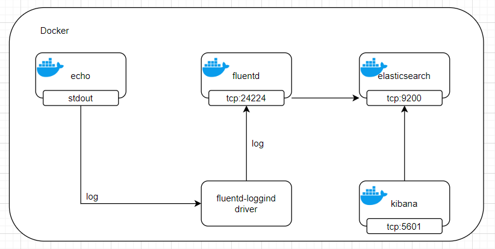
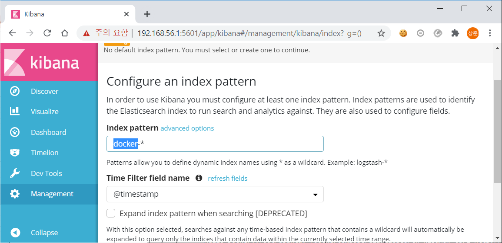
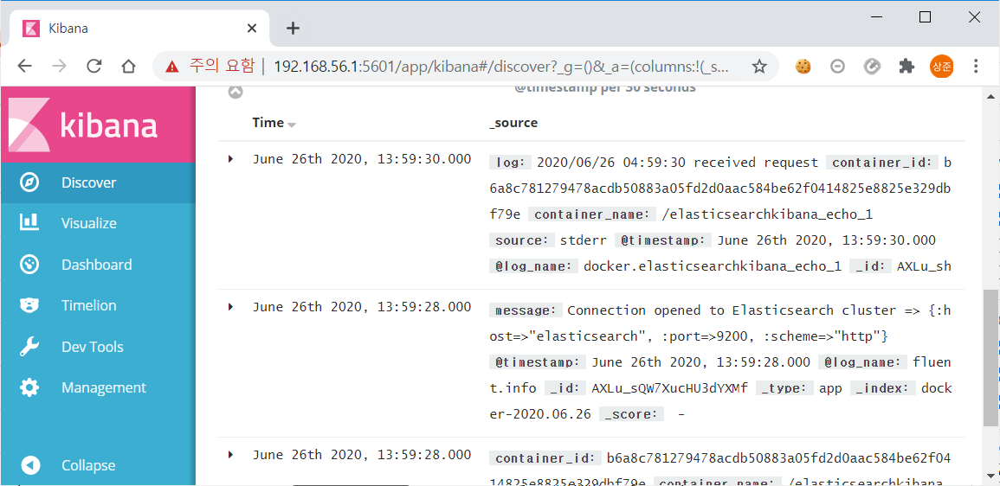
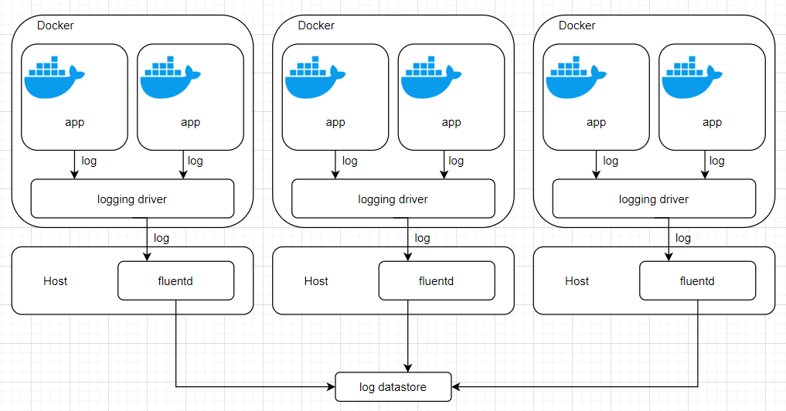

## 1. 로깅 운영

- INTRO
    - 컨테이너 환경의 효율적인 로그 관리 등 관리 운영적 부분에 중접을 두고 운영 환경에서 알아둬야 할 주의 사항을 설명한다.
- 컨테이너에서 생성되는 로그
    - 비컨테이너 환경
        - 서버 업타임이 길기 때문에 로그가 누적되어 상당한 디스크 용량을 차지하는 일이 자주 발생한다.
    - 도커
        - 로그 라이브러리를 사용해도 로그가 파일이 아니라 표준 출력으로 출력하고 이를 다시 Fluentd 같은 로그 컬렉터로 수집하는 경우가 많다.
        - 어플리케이션 쪽에서 로그 로테이션을 할 필요가 없으며 로그 전송을 돕는 로깅 드라이버 기능도 갖추고 있으므로 로그 수집이 편리하다.
    - 표준 출력과 로그
        - gihyodocker/echo:latest 사용
        - 포어그라운드로 실행한 다음 http://localhost:8080으로 요청을 보내면 표준 출력으로 출력된다.
            ```
            $ docker container run -it --rm -p 8080:8080 gihyodocker/echo:latest
            2020/06/26 02:19:53 start server
            2020/06/26 02:20:18 received request
            ```
        - 호스트에 컨테이너 데이터가 저장되는 디렉터리 : /var/lib/docker/containers/컨테이너ID
        - 컨테이너 데이터가 저장되는 디렉터리에 컨테이너ID-json.log 파일이 로그 파일이다.
            ```
            # 컨테이너ID : 9b0eb43784afcc61efb36de58c4115931a0fa51fb87629ee6cff8624e0dd999a
            $ tail /var/lib/docker/containers/[컨테이너ID]/[컨테이너ID]-json.log
            ```
            또는
            ```
            # 로그파일 있는 곳을 볼륨으로 컨테이너 생성
            $ docker container run -it --rm -v /var/lib/docker/containers:/json-log alpine ash
            / # cd json-log/[컨테이너ID]
            json-log/[컨테이너ID]/ # ls
            json-log/[컨테이너ID]/ # tail [컨테이너ID]-json.log
            ```
        - 컨테이너 표준 출력으로 출력된 내용이 JSON 포맷으로 출력된 것을 확인할 수 있다.
        - 어플리케이션에서 로그를 파일에 출력하도록 구현하지 않았더라도 도커에서 컨테이너의 표준 출력을 로그로 출력해 주는 것이다.
        - **로그 출력 자체를 완전히 도커에 맡길 수 있다.**
- 로깅 드라이버
    - 로그가 JSON 포맷으로 출력되는 이유는 도커에 json-file이라는 기본 로깅 드라이버가 있기 때문이다.
    - 로깅 드라이버 : 도커 컨테이너가 출력하는 로그를 어떻게 다룰지를 제어하는 역할을 한다.

    |종류|설명|
    |:---|:---|
    |Syslog|syslog로 로그를 관리|
    |Journald|systemd로 로그를 관리|
    |Awslogs|AWS CloudWatch Logs로 로그를 전송|
    |Gcplogs|Google Cloud Logging으로 로그를 전송|
    |Fluentd|fluentd로 로그를 관리|
- 컨테이너 로그 다루기
    - 장애로 인해 예기치 않게 컨테이너가 정지되고 디스크에서 완전히 삭제되었다면 컨테이너 안에 로그를 파일로 남기면 컨테이너를 삭제할 때 로그도 함께 잃어버린다는 큰 문제가 발생한다.
    - 방법
        - 호스트에서 컨테이너에 공유한 볼륨에 파일로 로그를 남기는 방법
        - 로그를 표준 출력으로 남기고 이 내용을 호스트에서 파일에 수집하는 방법
        - 도커에서는 후자를 정석으로 여긴다.
    - 컨테이너 로그의 로테이션
        - 도커 컨테이너 로깅 동작 제어 옵션 : --log-opt
            - --log-opt max-size=1m : 로테이션이 발생하는 로그 파일 최대 크기
            - --log-opt max-file=5 : 최대 파일 개수. 이 값을 초과할 경우 오래된 파일부터 삭제된다.
            ```
            $ docker container run -it --rm -p 8080:8080 --log-opt max-size=1m --log-opt max-file=5 gihyodocker/echo:latest
            ```
            - max-size로 설정한 파일 크기에 도달하면 파일이 로테이션된다.
                ```
                ----.log        # 최신
                ----.log.1      # 이전 로그
                ```
            - 이 설정은 컨테이너마다 일일이 할 필요는 없고, 도커 데몬에서 log-opts 기본값으로 설정할 수 있다.
                - /etc/docker/daemon.json
                    ```json
                    {
                        "log-driver" : "json-file",
                        "log-opts" : {
                            "max-size" : "10m",
                            "max-file" : "5"
                        }
                    }
                    ```
- Fluentd와 Elasticsearch를 이용한 로그 수집 및 검색 기능 구축
    - 파일 기반의 로그 관리 방식은 번거롭다.
    - 컨테이너가 출력하는 JSON 로그 파일을 다른 곳으로 전송해 모아놓고 관리 및 열람하는 기능이 필요하다.
    - 로그  수집 : 로그 컬렉터 Fluentd
    - 로그를 저장하는 데이터 스토어 : Elasticsearch

        

    - elasticsearch와 kibana 구축
        - docker-compose.yaml
            ```yml
            version: "3"
            services:
                elasticsearch:
                    image: elasticsearch:5.6-alpine
                    ports:
                        -   "9200:9200"
                    volumes:
                        -   "./jvm.options:/usr/share/elasticsearch/config/jvm.options"
                kibana:
                    image: kibana:5.6
                    ports:
                        -   "5601:5601"
                    environment:
                        ELASTICSEARCH_URL: "http://elasticsearch:9200"
                    depends_on:
                        -   elasticsearch
            ```
        - jvm.options
            ```
            -Xms128m
            -Xmx256m
            -XX:+UseConcMarkSweepGC
            -XX:CMSInitiatingOccupancyFraction=75
            -XX:+UseCMSInitiatingOccupancyOnly
            -XX:+AlwaysPreTouch
            -server
            -Xss1m
            -Djava.awt.headless=true
            -Dfile.encoding=UTF-8
            -Djna.nosys=true
            -Djdk.io.permissionsUseCanonicalPath=true
            -Dio.netty.noUnsafe=true
            -Dio.netty.noKeySetOptimization=true
            -Dio.netty.recycler.maxCapacityPerThread=0
            -Dlog4j.shutdownHookEnabled=false
            -Dlog4j2.disable.jmx=true
            -Dlog4j.skipJansi=true
            -XX:+HeapDumpOnOutOfMemoryError
            ```
        - docker-compose 실행 및 확인
            ```
            $ docker-compose up -d
            $ docker container ls
            ```
    - fluentd 구축
        - Dockerfile
            ```Dockerfile
            FROM fluent/fluentd:v0.12-debian

            RUN gem install fluent-plugin-elasticsearch --no-rdoc --no-ri --version 1.9.2
            COPY fluent.conf /fluentd/etc/fluent.conf
            ```
        - fluent.conf
            ```conf
            <source>
                @type forward
                port 24224
                bind 0.0.0.0
            </source>

            <match *.**>
                @type copy
                <store>
                    type elasticsearch
                    host elasticsearch
                    port 9200
                    logstash_format true
                    logstash_prefix docker
                    logstash_dataformat %Y%m%d
                    include_tag_key true
                    type_name app
                    tag_key @log_name
                    flush_interval 5s
                </store>
                <store>
                    type file
                    path /fluentd/log/docker_app
                </store>
            </match>
            ```
        - image 생성
            ```
            $ docker image build -t ch08/fluentd-elasticsearch:latest .
            ```
    - fluentd 로딩 드라이버로 컨테이너 로그 전송
        - docker-compose.yaml 수정
            ```yml
            services:
                elasticsearch:
                    image: elasticsearch:5.6-alpine
                    ports:
                        -   "9200:9200"
                    volumes:
                        -   "./jvm.options:/usr/share/elasticsearch/config/jvm.options"
                kibana:
                    image: kibana:5.6
                    ports:
                        -   "5601:5601"
                    environment:
                            ELASTICSEARCH_URL: "http://elasticsearch:9200"
                    depends_on:
                        -   asticsearch
                fluentd:
                    image: ch08/fluentd-elasticsearch:latest
                    ports:
                        - "24224:24224"
                        - "24220:24220"
                    depends_on:
                        -   elasticsearch
                echo:
                    image: gihyodocker/echo:latest
                    ports:
                        -   "8080:8080"
                    logging:
                        driver: "fluentd"
                        options:
                            fluentd-address: "localhost:24224"
                            tag: "docker.{{ .Name }}"
                    depends_on:
                        -   fluentd
            ```
        - 로그 생성(여러번 실행한다.)
            ```
            $ curl http://localhost:8080
            ```
    - 로그 확인하기
        - fluent.conf의 flush_interval 값이 로그를 Elasticsearch로 보내는 시간 간격이다.
        - elasticsearch가 만든 인덱스는 다음과 같이 확인할 수 있다.
            ```
            $ curl http://localhost:9200/_cat/indices?v
            ```
        - docker-yyyymmdd 형식으로 인덱스가 생성되었음을 확인할 수 있다.
        - 이름은 fluent.conf 파일에서 logstash_prefix, logstash_dateformat 값으로 설정된 것이다.
        - kibana 접속 : http://localhost:5601/app/kibana

            

            
- flentd 로깅 드라이버의 운영 구조
    - 일반적인 구조
        
        
    - 각 호스트에 fluentd를 배치하고 항상 가동 상태 유지
        - fluentd가 한 호스트에만 배치되었을 때 로그가 한 곳에 수집되는 형태는 잉여성을 확보할 필요가 있고, 호스트 수나 발생하는 로그 양에 걸맞은 fluentd를 갖추기도 번거롭다.
        - fluentd를 모든 호스트에 배치하였을 때는 장애가 발생해도 해당 호스트의 로그 수집에만 영향을 국한할 수 있다.
        - 이 방법은 fluentd를 모든 호스트에 배치하는 것이 중요하다.
        - 가상 머신 이미지에 fluentd를 포함시키거나 어플리케이션 컨테이너를 배포하기 전에 프로비저닝을 통해 fluentd를 배치하는 것이 효과적이다.
    - fluentd 모니터링 사항
        - buffer_queue_length : 버퍼에 저장된 청크의 수
        - buffer_total_queued_size : 버퍼에 저장된 청크의 크기 합
        - retry_count : 재시도 횟수
    - fluent.conf 파일에 monitor_agent를 설정해 이 항목의 상태를 확인할 수 있다.
        ```conf
        <source>
            @type monitor_agent
            bind 0.0.0.0
            port 24220
        </source>
        ```
    - monitor_agent를 지원하는 Sensu 플러그인도 제공되므로 다양한 통합 감시 소프트웨어로 fluentd를 모니터링할 수 있다.
- 가용성과 신뢰성을 갖춘 로그 스토리지 선택
    - elasticsearch같은 데이터스토어를 안정적으로 운영한다는 것은 쉬운 일이 아니다.
    - Elastic Cloud, AWS Elasticsearch Service 와 같은 매니지드 서비스를 이용하는 것도 고려할만 하다.
    - Amazon S3, Google Cloud Storage 같은 오브젝트 스토리지도 좋은 솔루션이다.
    - elasticsearch, 오브젝트 스토리지 양쪽으로 로그를 전송하되 최근 로그는 일정기간 Elasticsearch에서 다루게 한다면 비용을 절감할 수 있다.
- 쿠버네티스에서 로그 관리하기
    - 로컬 쿠버네티스를 사용하여 구축한다.
    - 쿠버네티스의 로그 관리 역시 도커(도커 컴포즈)와 크게 다르지 않다.
    - 쿠버네티스는 다수의 도커 호스트를 노드로 운영하는데, 어떤 노드에 어떤 파드가 배치될지는 쿠버네티스 스케줄러가 결정한다.
    - 각 컨테이너가 독자적으로 로그를 관리하면 비용(리소스)이 많이 든다.
    - 쿠버네티스 환경에 Elasticsearch와 kibana를 구축한 뒤 fluentd와 DaemonSet을 구축한다.
        - 쿠버네티스에 Elasticsearch와 kibana 구축
            - 로그는 네임스페이스를 뛰어넘어 Elasticsearch에 모여야 로그 검색에 편리하므로 kube-system 네임스페이스에 배치한다.
            - elasticsearch.yaml
                ```yml
                kind: PersistentVolumeClaim
                apiVersion: v1
                metadata:
                    name: elasticsearch-pvc
                    namespace: kube-system
                    labels:
                        kubernetes.io/cluster-service: "true"
                spec:
                    accessModes:
                        -   ReadWriteOnce
                    resources:
                        requests:
                            storage: 2Gi
                ---
                apiVersion: v1
                kind: Service
                metadata:
                    name: elasticsearch
                    namespace: kube-system
                spec:
                    selector:
                        app: elasticsearch
                    ports:
                        -   protocol: TCP
                            port: 9200
                            targetPort: http
                ---
                apiVersion: apps/v1
                kind: Deployment
                metadata:
                    name: elasticsearch
                    namespace: kube-system
                    labels:
                        app: elasticsearch
                spec:
                    replicas: 1
                    selector:
                        matchLabels:
                            app: elasticsearch
                    template:
                        metadata:
                            labels:
                                app: elasticsearch
                        spec:
                            containers:
                                -   name: elasticsearch
                                    image: elasticsearch:5.6-alpine
                                    ports:
                                        -   containerPort: 9200
                                            name: http
                                    volumeMounts:
                                        -   mountPath: /data
                                            name: elasticsearch-pvc
                                        -   mountPath: /usr/share/elasticsearch/config/elasticsearch.yml
                                            name: elasticsearch-config-elasticsearch-yml
                                            subPath: elasticsearch.yml
                                        -   mountPath: /usr/share/elasticsearch/config/log4j2.properties
                                            name: elasticsearch-config-log4j2-properties
                                            subPath: log4j2.properties
                                        -   mountPath: /usr/share/elasticsearch/config/jvm.options
                                            name: elasticsearch-config-jvm-options
                                            subPath: jvm.options
                            volumes:
                                -   name: elasticsearch-pvc
                                    persistentVolumeClaim:
                                        claimName: elasticsearch-pvc
                                -   name: elasticsearch-config-elasticsearch-yml
                                    configMap:
                                        name: elasticsearch-config-elasticsearch-yml
                                        defaultMode: 0777
                                -   name: elasticsearch-config-log4j2-properties
                                    configMap:
                                        name: elasticsearch-config-log4j2-properties
                                        defaultMode: 0777
                                -   name: elasticsearch-config-jvm-options
                                    configMap:
                                        name: elasticsearch-config-jvm-options
                                        defaultMode: 0777
                ---
                kind: ConfigMap
                apiVersion: v1
                metadata:
                    name: elasticsearch-config-elasticsearch-yml
                    namespace: kube-system
                data:
                    elasticsearch.yml: |-
                        http.host: 0.0.0.0
                ---
                kind: ConfigMap
                apiVersion: v1
                metadata:
                    name: elasticsearch-config-log4j2-properties
                    namespace: kube-system
                data:
                    log4j2.properties: |-
                        status = error

                        appender.console.type = Console
                        appender.console.name = console
                        appender.console.layout.type = PatternLayout
                        appender.console.layout.pattern = [%d{ISO8601}][%-5p][%-25c{1.}] %marker%m%n

                        rootLogger.level = info
                        rootLogger.appenderRef.console.ref = console
                ---
                kind: ConfigMap
                apiVersion: v1
                metadata:
                    name: elasticsearch-config-jvm-options
                    namespace: kube-system
                data:
                    jvm.options: |-
                        -Xms128m
                        -Xmx256m
                        -XX:+UseConcMarkSweepGC
                        -XX:CMSInitiatingOccupancyFraction=75
                        -XX:+UseCMSInitiatingOccupancyOnly
                        -XX:+AlwaysPreTouch
                        -server
                        -Xss1m
                        -Djava.awt.headless=true
                        -Dfile.encoding=UTF-8
                        -Djna.nosys=true
                        -Djdk.io.permissionsUseCanonicalPath=true
                        -Dio.netty.noUnsafe=true
                        -Dio.netty.noKeySetOptimization=true
                        -Dio.netty.recycler.maxCapacityPerThread=0
                        -Dlog4j.shutdownHookEnabled=false
                        -Dlog4j2.disable.jmx=true
                        -Dlog4j.skipJansi=true
                        -XX:+HeapDumpOnOutOfMemoryError
                ```
                - 쿠버네티스 컨피그맵을 사용해 컨테이너 안의 파일을 덮어쓸 수 있다.
                - 매니페스트 파일을 쿠버네티스에 적용한다.
            - kibana 역시 kube-system 네임스페이스에 배치한다.
            - kibana.yaml
                ```yml
                apiVersion: v1
                kind: Service
                metadata:
                    name: kibana
                    namespace: kube-system
                spec:
                    selector:
                        app: kibana
                    ports:
                        -   protocol: TCP
                            port: 5601
                            targetPort: http
                            nodePort: 30050
                    type: NodePort
                ---
                apiVersion: apps/v1
                kind: Deployment
                metadata:
                    name: kibana
                    namespace: kube-system
                    labels:
                        app: kibana
                spec:
                    replicas: 1
                    selector:
                        matchLabels:
                            app: kibana
                    template:
                        metadata:
                            labels:
                                app: kibana
                        spec:
                            containers:
                                -   name: kibana
                                    image: kibana:5.6
                                    ports:
                                        -   containerPort: 5601
                                            name: http
                                    env:
                                        -   name: ELASTICSEARCH_URL
                                            value: "http://elasticsearch:9200"
                ```
                - elasticsearch의 ClusterIP를 env.URL의 value로 넣어준다.
                - 매니페스트 파일을 쿠버네티스에 적용한다.
        - DaemonSet으로 fluentd 구축
            - DaemonSet : 파드를 관리하는 리소스로, 모든 노드에 하나씩 배치된다.
            - fluentd-daemonset.yaml
                ```yml
                apiVersion: apps/v1
                kind: DaemonSet
                metadata:
                    name: fluentd
                    namespace: kube-system
                    labels:
                        app: fluentd-logging
                        version: v1
                        kubernetes.io/cluster-service: "true"
                spec:
                    selector:
                        matchLabels:
                            app: fluentd-logging
                    template:
                        metadata:
                            labels:
                                app: fluentd-logging
                                version: v1
                                kubernetes.io/cluster-service: "true"
                        spec:
                            tolerations:
                                -   key: node-role.kubernetes.io/master
                                    effect: NoSchedule
                            containers:
                                -   name: fluentd
                                    image: fluent/fluentd-kubernetes-daemonset:elasticsearch
                                    env:
                                        -   name: FLUENT_ELASTICSEARCH_HOST
                                            value: "elasticsearch"
                                        -   name: FLUENT_ELASTICSEARCH_PORT
                                            value: "9200"
                                        -   name: FLUENT_ELASTICSEARCH_SCHEME
                                            value: "http"
                                    resources:
                                        limits:
                                            memory: 200Mi
                                        requests:
                                            cpu: 100m
                                            memory: 200Mi
                                    volumeMounts:
                                        -   name: varlog
                                            mountPath: /var/log
                                        -   name: varlibdockercontainers
                                            mountPath: /var/lib/docker/containers
                                            readOnly: true
                            terminationGracePeriodSeconds: 30
                            volumes:
                                -   name: varlog
                                    hostPath:
                                        path: /var/log
                                -   name: varlibdockercontainers
                                    hostPath:
                                        path: /var/lib/docker/containers
                ```
                - elasticsearch의 ClusterIP를 env.HOST의 value로 넣어준다.
                - 매니페스트 파일을 쿠버네티스에 적용한다.
        - 어플리케이션 파드 실행
            - 환경변수 LOG_STDOUT의 값에 따라 JSON 포맷으로 된 접근 로그를 표준 출력으로 출력한다.
            - echo.yaml
                ```yml
                apiVersion: v1
                kind: Service
                metadata:
                    name: echo
                spec:
                    selector:
                        app: echo
                    ports:
                        -   protocol: TCP
                            port: 80
                            targetPort: http
                            nodePort: 30080
                    type: NodePort                
                ---
                apiVersion: apps/v1
                kind: Deployment
                metadata:
                    name: echo
                    labels:
                        app: echo
                spec:
                    replicas: 1
                    selector:
                        matchLabels:
                            app: echo
                    template:
                        metadata:
                            labels:
                                app: echo
                        spec:
                            containers:
                                -   name: nginx
                                    image: gihyodocker/nginx:latest
                                    env:
                                        -   name: BACKEND_HOST
                                            value: localhost:8080
                                        -   name: LOG_STDOUT
                                            value: "true"
                                    ports:
                                        -   name: http
                                            containerPort: 80
                                -   name: echo
                                    image: gihyodocker/echo:latest
                                    ports:
                                        -   containerPort: 8080
                ```
        - 키바나와 echo어플리케이션 인그레스
            - echo-ingress.yaml
                ```yml
                apiVersion: extensions/v1beta1
                kind: Ingress
                metadata:
                    name: echo
                    labels:
                        app: echo
                spec:
                    rules:
                        -   host: echoservice
                            http:
                                paths:
                                    -   backend:
                                            serviceName: echo
                                            servicePort: 80
                ```
            - kibana-ingress.yaml
                ```yml
                metadata:
                    name: kibana
                    namespace: kube-system
                    labels:
                        app: kibana
                spec:
                    rules:
                        -   http:
                                paths:
                                    -   backend:
                                            serviceName: kibana
                                            servicePort: 5601
                ```
        - echo 컨테이너에서 어플리케이션이 출력한 로그는 log 필드에 등록되며 그 외 레이블, 파드명, 컨테이너명 등을 볼 수 있다.
        - nginx 컨테이너의 로그는 쿠버네티스와 관련된 필드 뿐만 아니라 nginx 접근 로그의 항목도 별도의 필드로 포함되어 있다.
        - fluent/fluentd-kubernetes-daemonset을 사용하면 컨테이너에서 출력된 표준 출력 로그가 JSON 포맷일 경우 이를 파싱해 모든 속성을 인덱싱에 포함해준다.
        - 어플리케이션 및 미들웨어 컨테이너의 로그를 전부 JSON 포맷으로 변환하 별도로 인덱싱하고 싶은 항목을 속성으로 분리해두는 것이 중요하다.
    - 도커/쿠버네티스 로그 관리 원칙
        1. 어플리케이션 로그는 모두 표준 출력으로 출력한다. 컨테이너로 운영하는 것을 전제로 한다면 파일 출력 자체가 불필요하다.
        2. nginx 등의 미들웨어는 로그가 표준 출력으로 출력되도록 이미지를 빌드한다.
        3. 표준 출력으로 출력되는 로그는 모두 JSON 포맷으로 출력해 각 속성을 검색할 수 있게 한다.
        4. 쿠버네티스 환경에서는 fluent/fluentd-kubernetes-daemonset을 포함한 파드를 DaemonSet을 사용해 각 호스트에 배치한다.
        5. 쿠버네티스 리소스에는 적절히 레이블을 부여해 로그를 검색할 수 있게 한다.
- 그 외의 로그 수집 도구
    - 구글 스택드라이버
        - 스택드라이버 : GCP나 AWS에서 로깅 및 모니터링에 사용되는 매니지드 서비스
    - stern
        - 보다 가벼운 로그 열람 도구
        - 레이블을 지정하면 실행 중인 파드에 속한 컨테이너의 로그를 볼 수 있다.
        - 예시
            ```
            $ stern -l app=echo
            $ stern -l app=todoweb --context [컨텍스트 지정]
            ```
            
## 2. 도커 호스트 및 데몬 운영

- INTRO
    - 비 매니지드 환경에서 도커를 운영하면 도커 호스트 및 도커 데몬(dockerd)를 다루는 경우가 많다.
- 컨테이너의 라이브 리스토어
    - dockerd
        - 도커 이미지와 컨테이너, 네트워클르 관리하는 데몬
        - dockerd가 실행 중이 아니어도 컨테이너를 실행하는 방법 : 라이브 리스토어 기능 사용
    - 라이브 리스토어
        - `--live-restore` 옵션을 붙이면 실행중인 컨테이너를 정지하지 않고도 도커를 정지할 수 있다.
        - 컨테이너 정지 없이 온더플라이(on-the-fly) 방식으로 도커를 업데이트할 수 있다.
        - 보안 업데이트 등의 이유로 도커를 업데이트하지 않으면 안 되는 상황이 있는데, 업데이트하는 동안 어플리케이션 컨테이너를 정지하지 않고 유지할 수 있다.
    - 예시 : 우분투 16.x 환경에서 systemd로 도커를 서비스 형태로 운영한다.
        - /lib/systemd/system/docker.service 파일의 내용과 다음과 같이 `--live-resotre`옵션을 추가한다.
            ```
            [Service]
            ExecStart=/usr/bin/dockerd --live-restore
            ```
        - 변경된 내용을 systemd에 반영한 다음 도커를 재시작한다.
            ```
            $ systemctl daemon-reload
            $ service docker restart
            ```
        - 실행 중인 커네티언가 1개라면 프로세스는 다음과 같이 컨테이너 프로세스와 dockerd 프로세스 2개가 동작하고 있을 것이다.
            ```
            $ ps -A | grep docker
            ```
        - 컨테이너가 실행 중인 상태에서 dockerd를 정지하면, 정지 했음에도 프로세스가 실행중임을 확인할 수 있다.
            ```
            $ service docker container stop
            $ ps -A | grep docker
            ```
        - 이 상태에서 도커 업데이트 등 유지보수 작업을 진행하면 된다.
- dockerd 튜닝하기
    - max-concurrent-downloads 옵션
        - docker image pull 명령에서 일어나는 이미지 다운로드를 수행하는 스레드 수를 결정하는 옵션으로 기본값은 3이다.
        - 한 이미지를 동시에 내려받는 스레드 수를 뜻하는 것이지, 내려받는 이미지의 수를 의미하는 값은 아니다.
        - /etc/docker/daemon.json 에서 max-concurrent-download 수정
            ```json
            {
                "max-concurrent-downloads": 5
            }
            ```
        - 5개 레이어에서 병렬로 다운로드가 일어난다.
    - max-concurrent-uploads
        - docker image push 명령에서 일어나는 이미지 업로드를 수행하는 스레드 수를 결정하는 옵션으로 기본값은 5이다.
        - /etc/docker/daemon.json 에서 max-concurrent-uploads 수정
            ```json
            {
                "max-concurrent-uploads": 8
            }
            ```
        - 8개 레이어에서 병렬로 업로드가 일어난다.
    - registry-mirror
        - 도커 허브의 미러를 설정하는 옵션이다.
        - 도커 허브에서 이미지를 자주 내려받게 되면 허브에 불필요한 트랙픽이 발생한다.
        - 도커 호스트 로컬에 레지스트리를 마련하고 이를 도커 허브의 미러로 사용한다.
        - daemon.json 설정
            ```json
            {
                "registry-mirrors": [
                    "http://localhost:5000"
                ]
            }
            ```
        - 미러 레지스트리를 확성화하려면 도커 허브에서 받아온 이미지를 미러 레지스트리에 캐싱해야 한다.
        - 미러 레지스트리에서 도커 허브를 프록시로 설정해 이미지가 캐시되게 한다.
        - 새로 만들 레지스트리의 설정 파일 config.yaml
            ```yml
            version: 0.1
            log:
                fields:
                    service: registry
            storage:
                cache:
                    blobdescriptor: inmemory
                filesystem:
                    rootdirectory: /var/lib/registry
            http:
                addr: :5000
                headers:
                    X-Content-Type-Options: [nosniff]
            health:
                storagedriver:
                    enabled: true
                    interval: 10s
                    threshold: 3
            proxy:
                remoteurl: https://registry-1.docker.io
            ```
            - proxy.remoteurl이 프록시 설정이므로 이 설정 값을 도커 허브 레지스트리의 URL로 설정하면 된다.
        - 미러 레지스트리 생성
            ```
            $ docker container run -d -p 5000:5000 -v ${PWD}/config.yaml:/etc/docker/registry/config.yml registry:2.6
            ```
        - 앞으로 docker image pull 명령으로 이전에 내려받은 적이 있는 이미지를 받으려고 하면 미러 레지스트리에서 이미지를 받아온다.
        - 도커 허브에서 이미지가 업데이트됐다면 업데이트된 이미지가 다시 미러 레지스트리에 캐싱된다.

## 3. 장애 대책 : 장애를 일으키기 쉬운 요인

- 도커 운영 시의 장애 대책
    - 장애를 막기 위한 이미지 운영
        - 도커 컨테이너는 docker container run 명령에 실행할 이미지를 지정하는 방법으로 실행한다.
        - 이것만으로는 실행될 컨테이너 내용의 정확성까지는 보장되지 않는다.
        - 의도치 않은 내용의 컨테이너가 실행될 위험
            - 운영환경에서 latest 버전의 이미지를 실행하거나 컨테이너 오케스트레이션 과정에서 최신 이미지를 실행한 상황
            - latest 외의 버전 이미지를 덮어쓴 상황
            - example/aaa:latest 태그로 빌드해야 할 이미지를 example/bbb:latest 태그로 빌드한 상황(다른 이미지와 바뀜)
    - 이미지 테스트
        - 비드된 이미지에 들어 있는 어플리케이션이 정상으로 동작하는지는 실행 단계에 가서야 알 수 있는 경우가 많다.
        - 이런 문제를 해결하려면 이미지가 원하는 구조로 되어 있는지 테스트 해야한다.
        - 이미지 테스트에는 주로 container-structure-test가 많이 사용된다.
        - container-structure-test는 구글에서 오픈소스로 공개한 테스트 프레임워크로 도커 이미지를 테스트 대상으로 한다.
        - [설치방법](https://github.com/GoogleContainerTools/container-structure-test)
        - container-structure-test를 사용한 tododb 이미지 테스트
            - test-tododb.yaml
                ```yml
                schemaVersion: "2.0.0"

                fileExistenceTests:
                    -   name: "init-data.sh"
                        path: "/usr/local/bin/init-data.sh"
                        shouldExist: true
                        permissions: "-rwxr-xr-x"

                fileContentTests:
                    -   name: "mysqld.cnf"
                        path: "/ext/mysql/mysql.conf.d/mysqld.cnf"
                        expectedContents: ['log-bin=\/var\/log\/mysql\/.*\.log']
                ```
                - fileExistenceTests : 컨테이너 안에 특정 파일의 존재 여부 테스트
                - fileContentTests : 파일의 내용을 확인하는 테스트
            - 이미지 테스트
                ```
                $ container-structure-test test --image gihyodocker/tododb:latest --config test-tododb.yaml
                ```
    - 디스크 용량 부족에 주의할 것
        - 디스크의 용량이 가득차면 새로운 컨테이너를 실행할 수 없으며 기존 컨테이너의 실행에도 지장이 생긴다.
        - 서드파트 모니터링 도구를 사용한 호스트 디스크 용량 모니터링은 필수이며, 도커에서도 디스크 용량을 낭비하지 않도록 해야 한다.
        - 컨테이너 배포가 잦은 환경이라면 내려받은 도커 이미지나 종료된 컨테이너 등이 디스크 용량을 많이 차지할 것이다.
        - `prune`을 사용하여 사용하지 않는 컨테이너 및 이미지의 파기를 하는 것이 유용하다.
            - `docker system prune -a`
        - cron을 사용하여 야간에 실행되도록 스케줄링하면 된다.
- 쿠버네티스 운영 시의 장애 대책
    - 노드가 장애를 일으켰을 때 쿠버네티스의 동작
        - 쿠버네티스에서 어플리케이션 파드가 배포될 때는 레플리카세트가 자동으로 파드를 배치한다.
        - 개발자가 노드를 전혀 신경쓰지 않아선 안된다.
        - 서버 장애로 이해 노드가 정상 작동하지 않을 가능성을 염두에 두고 파드를 배포해야 한다.
        - 노드가 장애를 일으켜 다운된 경우
            - 다운된 노드에 배포된 모든 파드는 즉시 정지되며 정상적인 다른 노드로 재배치된다. 이는 파드를 생성하는 레플리카세트가 지정된 수의 파드를 유지하려고 하기 때문이다.
            - 이러한 기능을 오토힐링(auto-healing)이라고 한다.
            - 레플리카세트가 관리하는 파드를 노드에서 의도적으로 삭제한 경우에도 같은 일이 일어난다.
        - 쿠버네티스에서는 레플리카세트를 관리하는 디플로이먼트나 스테이트풀세트, 데몬세트를 이용해 파드를 생성하는 것이 가장 좋은 대책이다.
    - 파드 안티 어피니티를 이용해 장애에 강한 파드 전략 수립
        - 레플리카세트의 오토힐링 기능은 편리하지만 완벽하지 않다.
        - replicas=1 이거나 노드가 다운된 순간 부터 다른 노드로 파드가 재배치되는 동안에는 다운타임을 피할 수 없다.
        - 임의의 노드가 다운되어도 문제가 발생하지 않도록 파드가 여러 노드에 나눠 배치되어야 한다.
        - 이를 위해 replicas 값을 적절히 조절하여 파드가 여러 노드에 걸쳐 배치되어 있는 만큼 다운타임 없이 파드가 재배치될 수 있을 것이다.
        - replicas=2 일때 파드가 같은 노드에 배치되어 있다면 다운타임이 발생한다.
        - 이를 해결하는 기능이 파드 안티 어피니티(Pod AntiAffinity)다.
            - 파드 간의 상성을 고려한 파드 배치전략을 규칙으로 정의한다.
            - 'C파드가 배치된 노드에는 D파드를 배치하지 않는다'와 같은 규칙을 정의할 수 있다.
            ```yml
            apiVersion: apps/v1
            kind: Deployment
            metadata:
                name: echo
                labels:
                    app: echo
            spec:
                replicas: 3
                selector:
                    matchLabels:
                        app: echo
                template:
                    metadata:
                        labels:
                            app: echo
                    spec:
                        affinity:
                            podAntiAffinity:
                                requiredDuringSchedulingIgnoreDuringExecution:
                                    -   labelSelector:
                                            matchExpressions:
                                                -   key: app
                                                    operator: In
                                                    values:
                                                        -   echo
                                        topologyKey: "kubernetes.io/hostname"
                        containers:
                            -   name: nginx
                                image: gihyodocker/nginx:latest
                                env:
                                    -   name: BACKEND_HOST
                                        value: localhost:8080
                                ports:
                                    -   containerPort: 80
                            -   name: echo
                                image: gihyodocker/echo:latest
                                ports:
                                    -   containerPort: 8080
            ```
            - labelSelector : 'app=echo인 파드'라는 조건
            - topologyKey : 이 조건을 적용할 대상
            - kubernetes.io/hostname : 노드가 가져야 할 레이블
            - '레이블이 app=echo인 파드가 배포된 노드'인 조건을 거부한다.
            - app=echo인 파드가 배치된 노드에는 app=echo인 파드를 배치하지 않는다.
            - 파드를 배치할 수 있는 노드가 부족하면 파드를 지정한 수만큼 배치할 수 없어 Pending(배치 보류) tkdxork ehlsek.
        - 파드 어피니티/안티어피니티를 이용하면 파드 배치를 좀 더 전략적으로 할 수 있다.(고급 기능)
    - CPU 부하가 큰 파드를 노드 어피니티로 격리
        - 일시적으로 CPU 자원을 많이 사용하는 파드를 실행하는 경우, 같은 노드에 배치된 다른 파드의 성능을 떨어뜨린다.
        - CPU 자원을 과도하게 소모하는 파드르르 전용 노드로 격리해서 다른 파드에 대한 영향을 차단해야 한다.
        - 격리
            - 노드에 용도별로 구분 짓는 레이블을 부여하고 파드 배치 규칙에 대한 해당 레이블을 갖는 노드에만 파드를 배치하면 된다.
            - 특정 레이블이 부여된 노드에만 파드를 배치하는 규칙을 정의하는 것이 바로 노드 어피니티다.
            - 노드에 레이블을 부여하려면 instancegroup 값을 설정하면 된다.
        - 예시
            - high-cpu-job.yaml
                ```yml
                apiVersion: apps/v1
                kind: Deployment
                metadata:
                    name: hight-cpu-job
                    labels:
                        app: high-cpu-job
                spec:
                    replicas: 2
                    selector:
                        matchLabels:
                            app: high-cpu-job
                    template:
                        metadata:
                            labels:
                                app: high-cpu-job
                        spec:
                            affinity:
                                nodeAffinity:
                                    requiredDuringSchedulingIgnoredDuringExecution:
                                        nodeSelectorTerms:
                                            -   matchExpressions:
                                                    -   key: instancegroup
                                                        operator: In
                                                        values:
                                                            -   "batch"
                        containers:
                            -   name: high-cpu-job
                                image: example/high-cpu-job:latest
                ```
            - instancegroup=batch 레이블이 부여된 노드에만 파드가 배치된다.
            - GKE의 NodePool에 부여되는 레이블은 cloud.google.com/gke-condepoll이다.
            - 정의된 규칙에 부합하는 노드가 없는 경우, 파드는 배치되지 않고 Pending 상태로 남는다.
        - 노드 어피니티를 이용해 파드를 부하 수준에 맞는 노드로 배치할 수 있으며, 다른 파드의 성능 저하를 방지할 수 있다.
    - HPA(Horizontal Pod Autoscaling)를 이용한 파드 오트스케일링
        - HPA는 시스템 리소스 사용률에 따라파드 수를 자동으로 조정하는 쿠버네티스 리소스다.
        - HPA는 파드의 오토스케일링 조건을 디플로이먼트나 레플리카세트에 부여하기 위한 리소스다.
        - 예시
            - 노드에 대한 파드의 CPU 사용률이 40%를 넘었을 때 파드에 오토 스케일리을 적용
            - autoscaling.yaml
                ```yml
                apiVersion: autoscaling/v2beta1
                kind: HorizontalPodAutoscaler
                metadata:
                    name: echo
                spec:
                    scaleTargetRef:
                        apiVersion: apps/v1
                        kind: Deployment
                        name: echo
                    minReplicas: 1
                    maxReplicas: 3
                    metrics:
                        -   type: Resource
                            resource:
                                name: cpu
                                targetAverageUtilization: 40
                ```
            - 설정된 CPU 사용률 기준을 초과하면 자동으로 새로운 파드를 생성한다.
            - maxReplicas에 설정된 개수 이상의 파드를 생성할 수는 없다.
            - HPA는 Cluster Autoscaler와 함께 사용할 때 효과가 극대화된다.
    - Cluster Autoscaler를 이용한 노드 오토 스케일링
        - HPA가 파드의 오토스케일링 기능을 제공한다고 해도 파드를 배치할 노드 리소스가 충분하지 못할 수 있다.
        - 이런 경우에는 Cluster Autoscaler를 사용한다.
        - Cluster Autoscaler
            - 쿠버네티스 클러스터의 노드 수를 자동 조정하는 역할을 한다.
            - 쿠버네티스 리소스가 아니라 노드 오토스케일링 기능을 제공하는 별도의 도구다.
            - 쿠버네티스에서 노드 수를 조절하는 작업은 쿠버네티스가 실행중인 플랫폼(AWS, GCP, Azure)에 따라 달라진다.
        - GKE에서는 Cluster Autoscaler를 매니지드 서비스로 제공하므로 gcloud 명령만으로 Cluster Autoscaler가 적용된 클러스터를 생성할 수 있다.
            - `--enable-autoscaling` : 오토스케일링 활성화
            - `--min-nodes` : 최소 노드 수
            - `--max-nodes` : 최대 노드 수
            ```
            $ gcloud container clusters create gihyo \
            --machine-type=n1-standard-1 \
            --num-nodes=5 \
            --enable-autoscaling \
            --min-nodes 3 \
            --max-nodes 10
            ```
        - GKE 외의 플랫폼에서는 Cluster Autoscaler를 별도로 설치해야 한다.
        - 헬름을 이용하면 다음과 같이 편리하게 설치 할 수 있다.
            ```
            $ helm install --namespace kube-system --name cluster-autoscaler stable/cluster-autoscaler
            ```
        - Cluster Autoscaler는 HPA와 연동해 파드 수의 증감에 따라 노드 수를 자동으로 조정할 수 있다.
        - 클러스터 비용 통제를 위해 반드시 필요하다.
- 헬름의 릴리즈 히스토리 제한
    - 헬름으로 어플리케이션을 배포하는 경우 주의 할 점 : 릴리스 히스토리로 인한 문제
    - 헬름을 이용하는 쿠버네티스 클러스터에서 컨피그맵의 목록을 확인하면 어플리케이션명과 버전명이 붙은 컨피그맵이 생성되어 있다.
    - 헬름을 사용해 어플리케이션 설치와 업데이트를 반복하다 보면 그 횟수만큼 컨피그맵이 생긴다.
    - 헬름이 설치 히스토리를 저장하기 위해 컨피그맵을 사용하기 때문에 생성된다.
    - 이런 과정을 반복하다 보면 컨피그맵이 너무 많이 쌓여 helm ls 명령의 반응이 느려지거나 최악의 경우 배포 자체가 안 되는 경우가 생긴다.
    - 이런 문제를 피하기 위해 `helm init` 명령으로 틸러를 배포할 때 --history-max 옵션으로 히스토리 저장 최대 건수를 정하는 것이 좋다.
        ```
        $ helm init --history-max 20
        ```
- GKE On-Prem
    - 온프레미스에서도 개발환경을 쾌적하게 유지할 수 있다.
    - 온프레미스에서도 GKE와 동등한 쿠버네티스 환경을 구축할 수 있게 해준다.
