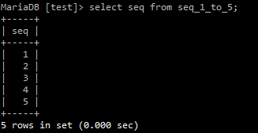
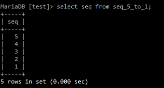
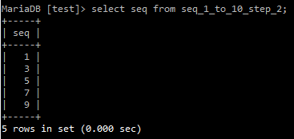
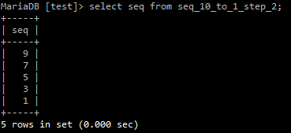
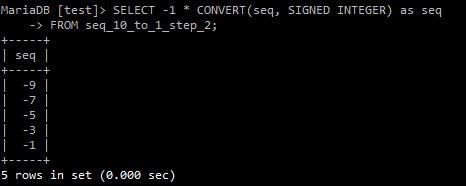

## 특징

- 단순히 순차적인 번호를 주어진 조건에 맞게 생성만 해주는 스토리지 엔진

- 시퀀스 객체와는 다르다.

- Unsigned 타입으로 음수 설정은 불가능하다.

---

## 사용법

```sql
SELECT seq
FROM seq_1_to_5;
```



```sql
SELECT seq
FROM seq_5_to_1;
```



```sql
SELECT seq
FROM seq_1_to_10_step_2;
```



최소값에서 2씩 증가한 값이 출력된다.

```sql
SELECT seq
FROM seq_10_to_1_step_2;
```



최소값에서 2씩 증가한 값이 역으로 출력된다.

```sql
SELECT -1 * CONVERT(seq, SIGNED INTEGER) as seq
FROM seq_10_to_1_step_2;
```



형변환을 통해 음수를 출력한다.

---

## 활용

> 테이블 내 누락 번호 찾기
>```sql
>SELECT s.seq
>FROM seq_1_to_10 s
>   LEFT OUTER JOIN tbl t on t.seq = s.seq
>WHERE t.seq is null;
>```

> 날짜 생성
>```sql
>SELECT date_add('2023-02-01', INTERVAL seq - 1 day) as seq_date
>FROM seq_1_to_10;
>```

---

## 추가

- 시퀀스 객체

    - 지정된 대로 일련의 숫자값을 생성하는 객체입니다.

    - 시퀀스 생성

    ```sql
        CREATE SEQUENCE seque START WITH 100 INCREMENT BY 10;
    ```

    - 시퀀스 사용

    ```sql
        NEXT VALUE FOR seque;
        NEXTVAL(seque);
    ```
