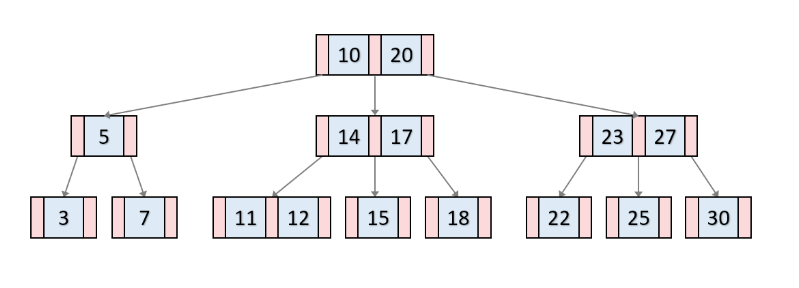
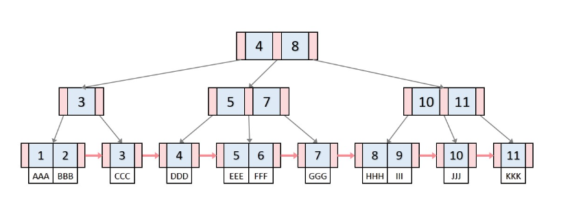

## 개념

1. 인덱스란?

  - SQL의 조회 성능을 향상시키기 위해서 테이블과는 별도로 생성되는 오브젝트

  - 모든 데이터를 검색하는 비효율적인 자원 사용을 제거하고, 디스크 I/O를 감소시키기 위해 사용

  - 테이블 용량 이외의 추가 공간이 필요하며, 데이터 구성에 따라 성능을 저하시킬 수 있다.

2. 종류

  - 단일 컬럼 인덱스

    - 하나의 컬럼으로 생성된 인덱스

  - 결합 컬럼 인덱스

    - 두 개 이상의 컬럼으로 생성된 인덱스

  - 클러스터 인덱스

    - Primary Key와 동일하며 Primary Key 순서로 데이터를 저장

3. 유형

  - Primary Key 인덱스

    - 중복값을 허용하지 않는 유일키

  - 일반 인덱스

    - 중복값을 허용하며 조건에 부합하는 데이터의 빠른 검색을 위해 사용하는 인덱스

  - Unique 인덱스

    - 중복된 값을 허용하지 않는 인덱스

    - Primary Key와의 차이로 Null 값을 유일값 간주

  - Fulltext 인덱스

    - 텍스트에 최적화된 인덱스

4. 구조

  - B-트리

    

    - 이진 검색 트리를 일반화한 형태로 매우 빠른 검색 속도를 유지한다. ( 이진검색 트리의 조회 속도 : O(logN) )

    - 균형 트리(Balanced Tree)로 데이터의 삽입/삭제가 발생할 때 마다 트리의 재구성이 필요하며, 대규모 데이터베이스에서 오버헤드를 유발할 수 있다.

    - Branch 노드와 Leaf 노드에 데이터를 저장한다.

    - [B-Tree 자료구조에 대한 자세한 설명]("https://velog.io/@emplam27/%EC%9E%90%EB%A3%8C%EA%B5%AC%EC%A1%B0-%EA%B7%B8%EB%A6%BC%EC%9C%BC%EB%A1%9C-%EC%95%8C%EC%95%84%EB%B3%B4%EB%8A%94-B-Tree")

  - B+트리

    

    - B-트리의 파생 구조

    - Leaf 노드에만 데이터를 저장하여 검색 속도를 높이고 범위 검색을 효과적으로 수행할 수 있다.

    - 삽입/삭제 작업에서 Leaf 노드만 수정하면 되기 때문에 효율적으로 인덱스를 유지할 수 있다.

    - [B+Tree 자료구조에 대한 자세한 설명]("https://velog.io/@emplam27/%EC%9E%90%EB%A3%8C%EA%B5%AC%EC%A1%B0-%EA%B7%B8%EB%A6%BC%EC%9C%BC%EB%A1%9C-%EC%95%8C%EC%95%84%EB%B3%B4%EB%8A%94-B-Plus-Tree")

## 구조

1. Primary Key 인덱스 구조

  - Primary Key 인덱스

    - Primary Key에 생성한 인덱스

    - 모든 값이 Unique하며 NOT NULL

    - Primary Key 특성을 그대로 유지

2. Secondary Key 인덱스

  - 인덱스를 구성하는 컬럼의 집합이 Unique일 필요는 없다.

  - 인덱스를 구성하는 컬럼의 모든 값이 NULL이여도 된다.

  - 조회는 Primary Key 인덱스를 조회하는 것과 비슷하지만 포함되는 데이터는 Primary Key만 포함하고 있어 Primary Key 인덱스를 다시 한번 엑세스 하여 데이터를 추출한다.

3. 클러스터 인덱스

  - 테이블에 Primary Key 인덱스가 존재한다면 해당 인덱스가 클러스터 인덱스이다.

  - Primary Key가 없는 경우 클러스터 인덱스의 선택 우선순위

    - NOT NULL 속서의 Unique 인덱스

    - 보이지 않는 컬럼을 내부적으로 생성하여 사용 : InnoDB에는 클러스터 인덱스가 없는 테이블은 존재하지 않는다.

  - 장점

    - 클러스터 Key를 통한 range 조회 시 처리 성능이 빠르다.

  - 단점

    - 모든 Secondary Key 인덱스가 클러스터 Key를 포함하기에 클러스터 Key의 크기가 클 경우 인덱스의 크기가 커진다.

    - Secondary Key를 통해 접근할 경우 성능이 저하된다.

    - 데이터를 삽입할 때 Primary Key에 의해 저장 위치가 결정되기에 처리 성능이 저하된다.

    - 클러스터 Key 값을 변경할 때 인덱스를 유지하기 위한 삭제/삽입 작업이 필요하기 때문에 처리 성능이 저하된다.

  - 주의 사항

    - 클러스터 Key의 크기가 커지면 secondary Key 인덱스도 자동으로 커지므로 클러스터 Key 값의 크기에 주의해야 한다.

    - 테이블의 데이터를 조회할 경우 클러스터 Key를 명시하여 사용하는 것이 유리하다.

## 인덱스의 관리

```sql
CREATE TABLE test_index(
  `idx` INT NOT NULL,
  `username` VARCHAR(20)
);

# 테이블 상태 확인
SHOW CREATE TABLE test_index;

# 단일 컬럼
CREATE INDEX ix_index_id ON test_index(idx);

# 결합 컬럼
## 조회 시 인덱스의 첫번째 컬럼이 WHERE 절에 명시되어 있어야 인덱스를 사용할 수 있다.
CREATE INDEX ix_index_id ON test_index(idx,name);

# Unique 인덱스 생성
## 컬럼 값들에 대한 유일성이 보장 될 때 사용할 수 있다.
CREATE UNIQUE INDEX ix_index_id ON test_index(idx);

# 인덱스 삭제
ALTER TABLE test_index DROP INDEX ix_index_id;
DROP INDEX ix_index_id ON test_index;

# 인덱스 상태 조회
SHOW INDEX FROM test_index;
```
