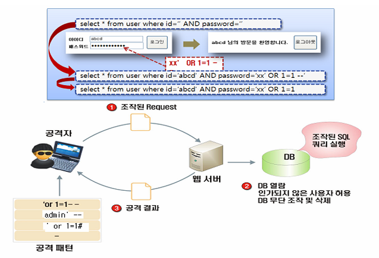

## 1.1. SQL 삽입

### 정의

데이터 베이스와 연동된 웹 어플리케이션에서 입력한 데이터에 대한 유효성 검증을 하지 않을 경우, 공격자가 입력 폼 및 URL 입력란에 SQL 문을 삽입하여 DB로부터 정보를 열람하거나 조작할 수 있는 보안 취약점을 말한다.



로그인 폼의 패스워드 입력란에 `xx' OR 1=1 --`를 넣으면 검증 없이 조립된 쿼리가 항상 참이 된다.

```text
아이디: abcd   패스워드: xx' OR 1=1 --

select * from user where id='abcd' AND password='xx' OR 1=1 --'
```

1. 공격자가 조작된 Request(`' or 1=1--`, `admin' --`, `' or 1=1#` 같은 공격 패턴)를 웹 서버로 보낸다.
2. 웹 서버가 조작된 SQL 쿼리를 그대로 실행해 DB 열람, 인가되지 않은 사용자 허용, DB 무단 조작 및 삭제가 일어난다.
3. 공격 결과가 공격자에게 돌아간다.

### 안전한 코딩 기법

- `preparedStatement` 기능을 사용하는 것이 바람직하다.
- 입력 값을 필터링 처리한 후 사용한다. 필터링 기준은 SQL 구문 제한, 특수 문자 제한, 길이 제한을 복합적으로 사용한다.

## 1.2. 코드 삽입

### 정의

공격자가 소프트웨어의 의도된 동작을 변경하도록 임의 코드를 삽입하여 소프트웨어가 비정상적으로 동작하도록 하는 보안약점을 말한다. 코드 삽입은 프로그래밍 언어 자체의 기능에 의해서만 제한된다는 점에서 운영체제 명령어 삽입과 다르다.

### 안전한 코딩 기법

- 동적 코드를 실행할 수 있는 함수를 사용하지 않는다.
- 필요 시, 실행 가능한 동적코드를 입력 값으로 받지 않도록, 외부 입력 값에 대하여 화이트리스트 방식으로 구현한다.
- 필요 시, 유효한 문자만 포함하도록 동적 코드에 사용되는 사용자 입력 값을 필터링 한다.

## 1.3. 경로 조작 및 자원 삽입

### 정의

검증되지 않은 외부 입력 값으로 파일 및 서버 등 시스템 자원에 대한 접근 혹은 식별을 허용할 경우, 입력 값 조작으로 시스템이 보호하는 자원에 임의로 접근할 수 있는 보안 약점이다. 경로 조작 및 자원 삽입 약점을 이용하여 공격자는 자원의 수정/삭제, 시스템 정보 누출, 시스템 자원 간 충돌로 인한 서비스 장애 등을 유발시킬 수 있다.

### 안전한 코딩 기법

- 외부의 입력을 자원(파일, 소켓의 포트 등)의 식별자로 사용하는 경우, 적절한 검증을 거치도록 한다.
- 사전에 정의된 적합한 리스트에서 선택되도록 한다.
- 외부의 입력이 파일 명인 경우에는 경로 순회 공격의 위험이 있는 문자(”, /, \ .. 등)를 제거할 수 있는 필터를 이용한다.

## 1.4. 크로스사이트 스크립트

### 정의

웹 페이지에 악의적인 스크립트를 포함시켜 사용자 측에서 실행되게 유도할 수 있다. 검증되지 않은 외부 입력이 동적 웹 페이지 생성에 사용될 경우, 전송된 동적 웹페이지를 열람하는 접속자의 권한으로 부적절한 스크립트가 수행되어 정보 유출 등의 공격을 유발할 수 있다.

### 안전한 코딩 기법

- 외부 입력 값 또는 출력 값에 스크립트가 삽입되지 못하도록 문자열 치환 함수를 사용한다.
    - `& < > " ' / ( )` 등의 문자를 `&amp; &gt; &lt;` 등의 문자로 치환
- 잘 알려진 크로스 사이트 스크립트 라이브러리 사용
- HTML 태그를 허용하는 게시판에서는 허용되는 HTML 태그들을 화이트리스트로 만들어 해당 태그만 지원하도록 적용

## 1.5. 운영체제 명령어 삽입

### 정의

적절한 검증절차를 거치지 않은 사용자 입력 값이 운영체제 명령어의 일부 또는 전부로 구성되어 실행되는 경우, 의도하지 않은 시스템 명령어가 실행되어 부적절하게 권한이 변경되거나 시스템 동작 및 운영에 악영향을 미칠 수 있다.

### 안전한 코딩 기법

- 웹 인터페이스로 서버 내부로 시스템 명령어를 전달시키지 않도록 구성
- 외부에서 전달되는 값을 검증 없이 시스템 내부 명령어로 사용하지 않는다.
- 외부 입력에 따라 명령어를 생성하거나 선택이 필요한 경우, 명령어 생성에 필요한 값들을 미리 지정해 놓고 외부 입력에 따라 선택하여 사용

## 1.6. 위험한 형식 파일 업로드

### 정의

서버 측에서 실행될 수 있는 스크립트 파일이 업로드 가능하고, 이 파일을 공격자가 웹으로 직접 실행시킬 수 있는 경우, 시스템 내부 명령어를 실행하거나 외부와 연결하여 시스템을 제어할 수 있는 보안 약점이다.

### 안전한 코딩 기법

- 화이트 리스트 방식으로 허용된 확장자만 업로드를 허용
- 업로드 되는 파일을 저장할 때, 파일명과 확장자를 외부 사용자가 추측할 수 없는 문자열로 변경
- 저장 경로는 web document root 밖에 위치시켜서 공격자의 웹으로 직접 접근을 차단
- 파일 실행 여부를 설정할 수 있는 경우, 실행 속성을 제거

## 1.7. 신뢰되지 않는 URL 주소로 자동접속 연결

### 정의

사용자로부터 입력되는 값을 외부사이트의 주소로 사용하여 자동으로 연결하는 서버 프로그램은 피싱 공격에 노출되는 취약점을 가질 수 있다.

일반적으로 클라이언트에서 전송된 URL 주소로 연결하기 때문에 안전하다고 생각할 수 있으나, 공격자는 해당 폼의 요청을 변조함으로써 사용자가 위험한 URL로 접속할 수 있도록 공격할 수 있다.

### 안전한 코딩 기법

- 자동 연결할 외부 사이트의 URL과 도메인은 화이트 리스트로 관리한다.
- 사용자 입력값을 자동 연결할 사이트 주소로 사용하는 경우, 입력된 값이 화이트 리스트에 존재하는지 확인해야 한다.

## 1.8. 부적절한 XML 외부 개체 참조

### 정의

XML 문서에는 DTD(Document Type Define)를 포함할 수 있으며, DTD는 XML Entity를 정의한다. 부적절한 XML 외부개체 참조 보안약점은 서버에서 XML 외부 엔티티를 처리할 수 있도록 설정된 경우에 발생할 수 있다.

취약한 XML parser가 외부 값을 참조하는 XML 값을 처리할 때, 공격자가 삽입한 공격 구문이 동작되어 서버 파일 접근, 불필요한 자원 사용, 인증 우회, 정보 노출 등이 발생할 수 있다.

### 안전한 코딩 기법

- 로컬 정적 DTD를 사용하도록 설정
- 외부에서 전송된 XML 문서에 포함된 DTD를 완전히 비활성화
- 비활성화를 할 수 없는 경우, 외부 엔티티 및 외부 문서 유형 선언을 각 파서에 맞는 고유한 방식으로 비활성화

## 1.9. XML 삽입

### 정의

검증되지 않은 외부 입력 값이 XQuery 또는 XPath 쿼리문을 생성하는 문자열로 사용되어 공격자가 쿼리문의 구조를 임의로 변경하고 임의의 쿼리를 실행하여 허가되지 않은 데이터를 열람하거나 인증 절차를 우회할 수 있는 보안 약점이다.

### 안전한 코딩 기법

- XQuery 또는 XPath 쿼리에 사용되는 외부 입력 데이터에 대하여 특수 문자 및 쿼리 예약어를 필터링하고 파라미터화된 쿼리문을 지원하는 XQuery를 사용

## 1.10. LDAP 삽입

### 정의

공격자가 외부 입력으로 의도하지 않은 LDAP(Lightweight Directory Access Protocol) 명령어를 수행할 수 있다. 즉, 웹 응용프로그램이 사용자가 제공한 입력을 올바르게 처리하지 못하면, 공격자가 LDAP 명령문의 구성을 바꿀 수 있다. 이로 인해 프로세스가 명령을 실행한 컴포넌트와 동일한 권한을 가지고 동작하게 된다.

외부 입력값을 적절한 처리 없이 LDAP 쿼리문이나 결과의 일부로 사용하는 경우, LDAP 쿼리문이 실행될 때 공격자는 LDAP 쿼리문의 내용을 마음대로 변경할 수 있다.

### 안전한 코딩 기법

- DN(Distinguished Name)과 필터에 사용되는 사용자 입력값에는 특수문자가 포함되지 않도록 특수문자를 제거
- 특수문자를 사용해야 하는 경우에는 특수문자가 실행 명령이 아닌 일반문자로 인식되도록 처리

## 1.11. 크로스사이트 요청 위조

### 정의

특정 웹사이트에 대해서 사용자가 인지하지 못한 상황에서 사용자의 의도와는 무관하게 공격자가 의도한 행위(수정, 삭제, 등록 등)를 요청하게 하는 공격을 말한다. 웹 응용프로그램이 사용자로부터 받은 요청에 대해서 사용자가 의도한 대로 작성되고 전송된 것인지 확인하지 않는 경우 발생 가능하고 특히 해당 사용자가 관리자인 경우 사용자 권한관리, 게시물삭제, 사용자 등록 등 관리자 권한으로만 수행 가능한 기능을 공격자의 의도대로 실행시킬 수 있게 된다.

공격자는 사용자가 인증한 세션이 특정 동작을 수행하여도 계속 유지되어 정상적인 요청과 비정상적인 요청을 구분하지 못하는 점을 악용한다. 웹 응용프로그램에 요청을 전달할 경우 해당 요청의 적법성을 입증하기 위하여 전달되는 값이 고정되어 있고 이러한 자료가 GET 방식으로 전달된다면 공격자가 이를 쉽게 알아내어 원하는 요청을 보냄으로써 위험한 작업을 요청할 수 있게 된다.

### 안전한 코딩 기법

- 입력화면 폼 작성 시 GET 방식보다는 POST 방식을 사용한다.
- 입력화면 폼과 해당 입력을 처리하는 프로그램 사이에 토큰을 사용하여 공격자의 직접적인 URL 사용이 동작하지 않도록 처리
- 중요한 기능에 대해서 사용자 세션 검증과 더불어 재인증을 유도

## 1.12. 서버사이드 요청 위조

### 정의

적절한 검증절차를 거치지 않은 사용자 입력 값을 서버간의 요청에 사용하여 악의적인 행위가 발생할 수 있는 보안약점이다.

외부에 노출된 웹 서버에 취약한 어플리케이션이 존재하는 경우 공격자는 URL 또는 요청문을 위조하여 접근통제를 우회하는 방식으로 비정상적인 동작을 유도하거나 신뢰된 네트워크에 있는 데이터를 획득할 수 있다.

### 안전한 코딩 기법

- 식별할 수 있는 범위 내에서 사용자의 입력 값을 다른 시스템의 서비스 호출에 사용하는 경우, 사용자의 입력 값을 화이트리스트 방식으로 필터링
- 사용자가 지정하는 무작위의 URL을 받아들여야 한다면, 내부의 URL을 블랙리스트로 지정하여 필터링
- 동일한 내부 네트워크에 있더라도 기기 인증, 접근권한을 확인하여 요청이 이루어질 수 있도록 한다.

## 1.13. HTTP 응답분할

### 정의

HTTP 요청에 들어 있는 파라미터가 HTTP 응답헤더에 포함되어 사용자에게 다시 전달될 때, 입력값에 CR(Carriage Return)이나 LF(Line Feed)와 같은 개행문자가 존재하면 HTTP 응답이 2개 이상으로 분리될 수 있다. 이 경우 공격자는 개행문자를 이용하여 첫 번째 응답을 종료시키고, 두 번째 응답에 악의적인 코드를 주입하여 XSS(크로스사이트 스크립트) 및 캐시 훼손(Cache Poisoning) 공격 등을 수행할 수 있다.

### 안전한 코딩 기법

- 요청 파라미터의 값을 HTTP 응답헤더에 포함시킬 경우 CR, LF와 같은 개행 문자를 제거한다.

## 1.14. 정수형 오버플로우

### 정의

정수형 오버플로우는 정수형 크기는 고정되어 있는데 저장 할 수 있는 범위를 넘어서, 크기보다 큰 값을 저장하려 할 때 실제 저장되는 값이 의도치 않게 아주 작은 수이거나 음수가 되어 프로그램이 예기치 않게 동작될 수 있다. 특히 반복문 제어, 메모리 할당, 메모리 복사 등을 위한 조건으로 사용자가 제공하는 입력값을 사용하고 그 과정에서 정수형 오버플로우가 발생하는 경우 보안상 문제를 유발할 수 있다.

### 안전한 코딩 기법

- 언어/플랫폼별 정수타입의 범위를 확인하여 사용한다. 정수형 변수를 연산에 사용하는 경우 결과값의 범위를 체크하는 모듈을 사용한다.
- 외부 입력값을 동적 메모리 할당에 사용하는 경우, 변수 값이 적절한 범위 내에 존재하는 값인지 확인한다.

## 1.15. 보안기능 결정에 사용되는 부적절한 입력값

### 정의

응용프로그램이 외부 입력값에 대한 신뢰를 전제로 보호메커니즘을 사용하는 경우 공격자가 입력값을 조작할 수 있다면 보호 메커니즘을 우회할 수 있게된다.

쿠키, 환경변수 또는 히든필드와 같은 입력값이 조작될 수 없다고 가정 하지만, 공격자는 다양한 방법으로 이러한 입력값들을 변경할 수 있고 조작된 내용은 탐지되지 않을 수 있다. 인증이나 인가와 같은 보안결정이 이런 입력값에 기반해 수행되는 경우 공격자는 이런 입력값을 조작하여 응용프로그램의 보안을 우회할 수 있으므로 충분한 암호화, 무결성 체크를 수행하고 이와 같은 메커니즘이 없는 경우엔 외부 사용자에 의한 입력값을 신뢰해서는 안된다.

### 안전한 코딩 기법

- 상태정보나 민감한 데이터 특히 사용자 세션정보와 같은 중요한 정보는 서버에 저장하고 보안확인 절차도 서버에서 실행한다.
- 보안설계관점에서 신뢰할 수 없는 입력값이 응용프로그램 내부로 들어올 수 있는 지점과 보안결정에 사용되는 입력값을 식별하고, 제공되는 입력값에 의존할 필요가 없는 구조로 변경할 수 있는지 검토한다.

## 1.16. 메모리 버퍼 오버플로우

### 정의

연속된 메모리 공간을 사용하는 프로그램에서 할당된 메모리의 범위를 넘어선 위치에 자료를 읽거나 쓰려고 할 때 발생한다. 프로그램의 오작동을 유발시키거나, 악의적인 코드를 실행시킴으로써 공격자가 프로그램을 통제할 수 있는 권한을 획득하게 한다.

### 안전한 코딩 기법

- 프로그램 상에서 메모리 버퍼를 사용할 경우 적절한 버퍼의 크기를 설정하고, 설정된 범위의 메모리 내에서 올바르게 읽거나 쓸 수 있게 통제하여야 한다.
- 문자열 저장 시 NULL 문자로 종료하지 않으면 의도하지 않은 결과를 가져오게 되므로 NULL 문자를 버퍼 범위 내에 삽입하여 NULL 문자로 종료되도록 해야 한다.

## 1.17. 포맷 스트링 삽입

### 정의

외부로부터 입력된 값을 검증하지 않고 입/출력 함수의 포맷 문자열 그대로 사용하는 경우 발생할 수 있는 보안 약점이다. 공격자는 포맷 문자열을 이용하여 취약한 프로세스를 공격하거나 메모리 내용을 읽거나 쓸 수 있다. 그 결과 공격자는 취약한 프로세스의 권한을 취득하여 임의의 코드를 실행할 수 있다.

### 안전한 코딩 기법

- 포맷 문자열을 사용하는 함수를 사용할 때는 사용자 입력값을 직접적으로 포맷 문자열로 사용하거나 포맷 문자열 생성에 포함시키지 않는다.
- 포맷 문자열을 사용하는 함수에 사용자 입력값을 사용할 때는 사용자가 포맷 스트링을 변경할 수 있는 구조로 쓰지 않는다.
- %n, %hn은 공격자가 이를 이용해 특정 메모리 위치에 특정값을 변경할 수 있으므로 포맷 스트링 매개변수로 사용하지 않는다.
- 사용자 입력값을 포맷 문자열을 사용하는 함수에 사용할 때는 가능하면 %s 포맷 문자열을 지정하고, 사용자 입력값은 2번째 이후의 파라미터로 사용한다.
